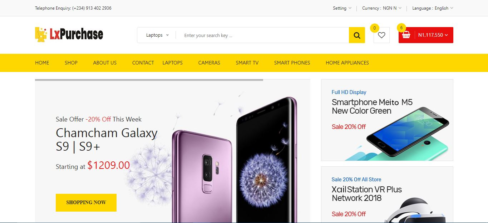

# E-Commerce Web Application
An E-Xommerce Web Application for Automated rendering and delivering of products to customers. 

## Application Features:
-   Automated Data Analysing Function
-   Simple and Clean UI
-   Easy Navigation
-   Works Offline with MySQL Database
-   For Store and Purchase Services

## Task and How To Use The Application
-   Choose || add a product you like to cart
-   Proceed to shop cart
-   Increase the products quantity 
-   Proceed to checkout page when ready
-   make a virtual payment

**For Offline Purposes**
After cloning the repo to your local computer, install the necessary nodemon dependencies, Create a database (MySQL Database) with the name "lxpurchase" import the file("lxpurchase.sql") from the "MySQL-DB" folder inside "Public". change the "Conn.js" to that of your local computer username and password.

Start the App with "npm start" on the CLT

## License
[LDC](LICENSE.md)
